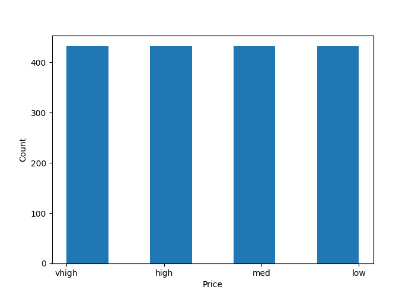
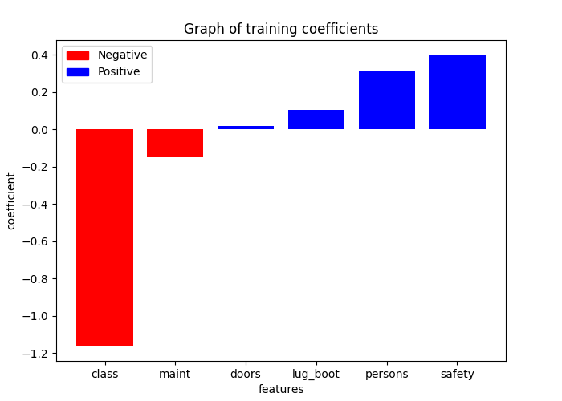

```{r, include=FALSE}
library(knitr)  
library(reticulate)  
```

```{python, include=FALSE}
import pandas as pd
from sklearn.model_selection import cross_validate, train_test_split
from sklearn.neighbors import KNeighborsClassifier
from sklearn.preprocessing import OneHotEncoder, OrdinalEncoder
from sklearn.pipeline import Pipeline, make_pipeline
from sklearn.compose import ColumnTransformer, make_column_transformer
from sklearn.linear_model import LogisticRegression
import matplotlib.pyplot as plt

import sys
sys.path.append( '..' )
from src.features import features
from src.visualize_coefficients import visualize_coefficients
from src.rm_null import rm_null
from src.feature_coeff_table import feature_coef_table
```

# Summary

We will be training a model to predict the price of a car using the given features: maintenance, number of doors, number of people that can fit in the 
car, car trunk space, safety and class.

# Introduction

When making large purchases, it is incredibly important to consider all of the factors that go into the pricing and decision to commit to buying. 
With a rise in car prices, this is an essential consideration. There are several factors that influence the price of a car, for example brand, size, 
safety, etc. The overall safety of a car increases the cost, because of individual features and equipment, including backup cameras, video displays and 
automatic emergency braking. When purchasing a vehicle, you are not only investing in the price of the car itself, but the cost of insurance, which is 
also influenced by a number of features. On average, the insurance cost for a 4-door car is cheaper than a 2-door, because of the target buyers, sticker 
and repair costs, etc. As 2-door cars are typically sports and luxury cars, the materials and technology used to manufacture them will likely be luxury 
as well. Following the same line of reasoning, the maintenance of a luxury car is expected to be more expensive. The maintenance cost is likely to be a 
large influential factor in the price, because it can account for above 30% of the total cost.

We are interested in determining the relationship between the buying price of a car and its' maintenance cost, number of doors, capacity, safety, the 
size of the luggage boot (trunk) and class. Therefore, the question we will be exploring in this analysis is: do these factors influence the cost of 
buying a car, and how? To study these relationships, we will be using the Car Evaluation dataset obtained from UC Irvine Machine Learning Repository 
[@misc_car_evaluation_19]. This dataset contains information about all of the explanatory variables for our analysis and buying price, represented as 
categorical values. Based on our initial research, we expect that maintenance and safety will be highly correlated with the buying price.

# Methods & Results

```{python include=FALSE}
# loading dataset into a readable dataframe

car_table = pd.read_csv('../data/car.data', sep = ",", header=None, names = ["price", "maint", "doors", "persons", "lug_boot", "safety", "class"],)

head = car_table.head()
# remove any nulls/nan values in the dataframe
rm_null(car_table)

price = pd.DataFrame(car_table["price"])
price.head()
```

```{r car-tab, echo=FALSE}

knitr::kable(py$head, caption='Car Features')
```

```{python include=FALSE}

price = pd.DataFrame(car_table["price"])

# price.value_counts().plot(kind='bar')
plt.hist(price, bins=7)
plt.xlabel("Price")
plt.ylabel("Count")
plt.savefig("../results/price_dist")
plt.figure(figsize=(15, 12), dpi= 300)
```

```{r, echo=FALSE, out.width='75%', fig.cap='Distribution of Price Variable'}

```

```{python include=FALSE}
# categorizing features(price, maint, doors, persons, lug_boot, safety, class) to be used a in column transformer to enable easy manipulation of data frame

ordinal_feats = ["price", "maint", "doors", "persons", "lug_boot", "safety", "class"]

# categories of each feature
maint_levels = ['low', 'med', 'high', 'vhigh']
doors_levels = ['2', '3', '4', '5more']
persons_levels = ['2', '4', 'more']
boot_levels = ['small', 'med', 'big']
safety_levels = ['low', 'med', 'high']
class_levels = ['unacc', 'acc', 'good', 'vgood']


# ordinal encoding of each feature
column_transformer = make_column_transformer(
    (OrdinalEncoder(categories=[maint_levels, maint_levels, doors_levels, persons_levels, boot_levels, safety_levels, class_levels],
                    dtype = int),
                    ordinal_feats)
)

X_transformed = column_transformer.fit_transform(car_table)
column_names = (ordinal_feats)


# creating new table after data preprcoessing 
new_table = pd.DataFrame(X_transformed, columns=column_names)

# splitting of target variable and features
X_car = features(new_table, 'price')
Y_car = new_table['price']


# splitting of data frame into training and testing data
X_train, X_Test, y_train, y_test = train_test_split(X_car, Y_car, test_size=0.2, random_state=1)

# features used for modeling
feats = ["maint", "doors", "persons", "lug_boot", "safety", "class"]

# fitting model for classification analysis

lr = LogisticRegression(max_iter=1000, C=100)
lr.fit(X_train, y_train)

coeffs = lr.coef_[3]

score = cross_validate(lr, X_Test, y_test, cv=10)

pd.DataFrame(score)

# coefficients of each feature

df1 = feature_coef_table(feats, coeffs)
coeff_df = pd.DataFrame(df1)
coeff_df = coeff_df[['features', 'coefficient']]
```

```{r echo=FALSE}
knitr::kable(py$coeff_df, caption="Weight of Features in a Linear Model")
```

``` {python, include=FALSE}
visualize_coefficients(df1, "Graph of training coefficients", "features", "coefficient")
plt.savefig("../results/coeff_fig1")
```

```{r echo=FALSE, out.width='75%', fig.cap='Training Coefficients of a Linear Model'}

```

# Discussion

We have found that higher values of class and maintenance features decrease the value of the vehicle. While safety and the higher number of people that 
can fit in the car increase the value of the car the most. It was not what we expected because the value of the vehicle being increased by more people 
is subjective. Some people may value having more seats in a car than others due to personal preference. Moreover, we cannot use this model to discuss 
the impacts of such findings because the accuracy of the model needs to be increased a lot more before anything can be reasonably/confidently inferred 
from it. In the future, we can see if adding more features such as horsepower or branding of the car affects the value of the vehicle. It would also be 
interesting to see if introducing more categories in our target variable would increase the accuracy of the model.
 
# References
